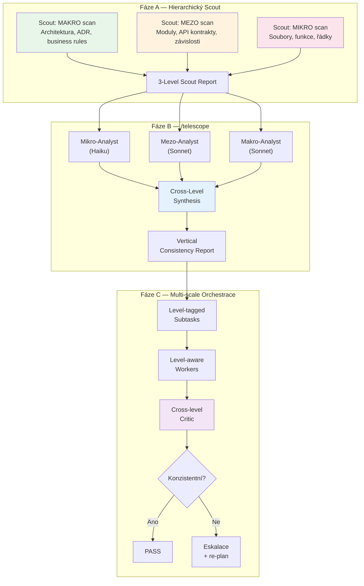
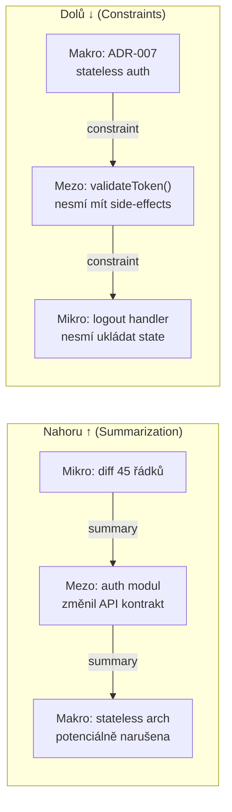
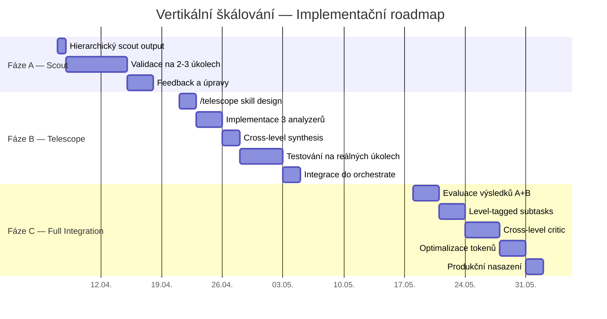

# Vertikální škálování STOPA orchestrace — Technická zpráva

**Datum:** 2026-04-07
**Autor:** STOPA Orchestration System / Deep Research
**Status:** Fáze A schválena, B+C naplánováno
**Podkladový research:** `outputs/vertical-scaling-research.md`

---

## 1. Rozklad problému

### 1.1 Proč horizontální role nestačí

STOPA dnes přiřazuje agentům **role** (scout, worker, critic), ale nerozlišuje **hloubku pohledu**. Každý agent operuje na jedné úrovni abstrakce — scout listuje soubory, worker edituje řádky, critic kontroluje diff.

```
DNES (horizontální):

  Scout ──→ Worker ──→ Critic
  (soubory)  (řádky)   (diff)

  Všichni vidí "jednu vrstvu" — žádný neví,
  co se děje nad nebo pod ním.
```

To vede ke třem kategoriím chyb:

| Kategorie | Příklad | Frekvence |
|-----------|---------|-----------|
| **Vertikální nekonzistence** | Mikro-fix porušuje makro-pravidlo | Odhadem 1 z 5 netriviálních úkolů |
| **Mezo bottleneck** | API kontrakt je křehký, ale nikdo ho nekontroluje | Odhadem 1 z 3 cross-module změn |
| **Emergence** | Série nevinných mikro-změn → systémový problém | Odhadem 1 z 10 dlouhodobých projektů |

### 1.2 Co říká výzkum

Akademické zdroje potvrzují problém z více stran:

- **HCAG (arXiv:2603.20299):** Flat RAG prokazatelně selhává na komplexních kódových bázích — logika distribuovaná přes hierarchickou strukturu je neviditelná pro snippet-level retrieval.
- **HexMachina (arXiv:2506.04651v2):** Fázová separace (discovery→improvement) je kritická — bez ní agenti konvergují na mělké heuristiky.
- **HTN+LLM (arXiv:2511.18165):** Čistě LLM hierarchické plánování má 1% syntaktickou validitu — hybridní enforcement je nutný.
- **HMAS Taxonomy (arXiv:2508.12683):** Temporal layering (různé časové horizonty per úroveň) je klíčová osa pro škálovatelnost.

---

## 2. Architektura řešení

### 2.1 Celkový diagram



### 2.2 Tok dat mezi úrovněmi



**Nahoru** proudí *summaries* — každá úroveň kondenzuje informace pro vyšší.
**Dolů** proudí *constraints* — vyšší úroveň říká nižší, co nesmí porušit.

---

## 3. Vývojový roadmap

### 3.1 Ganttův diagram



### 3.2 Milníky a rozhodovací body

| Milník | Datum | Podmínka pro pokračování |
|--------|-------|--------------------------|
| **A-DONE** | ~2026-04-17 | Scout 3-level output funguje na 3+ úkolech |
| **B-START** | 2026-04-21 | Scheduled reminder, A validováno |
| **B-DONE** | ~2026-05-05 | /telescope zachytí alespoň 1 reálný cross-level problém |
| **C-DECIDE** | 2026-05-18 | Scheduled reminder, evaluace ROI z B |
| **C-DONE** | ~2026-06-01 | Full integration, měřitelné zlepšení kvality |

**Go/No-Go kritéria pro fázi C:**
- Fáze B musí prokázat alespoň 1 zachycený problém, který by jinak prošel
- Token overhead < 40% vs baseline
- Žádný false-positive, který by zbytečně blokoval práci

---

## 4. Token cost srovnání

### 4.1 Per-task odhad (standardní orchestrace)

| Konfigurace | Tokeny | Cena (Sonnet) | Přidaná hodnota |
|-------------|--------|---------------|-----------------|
| **Baseline** (dnes) | ~150-250K | $0.45-0.75 | — |
| **+ Fáze A** (3-level scout) | ~155-260K | $0.47-0.78 | Lepší kontext, méně retries |
| **+ Fáze B** (/telescope) | ~210-315K | $0.63-0.95 | Cross-level detekce |
| **+ Fáze C** (full) | ~190-310K | $0.57-0.93 | Plná konzistence* |

*Fáze C může být LEVNĚJŠÍ než B díky optimalizaci — level-tagged context per worker snižuje context rot.

### 4.2 ROI analýza

| Scénář | Bez vert. škálování | S vert. škálováním | Úspora |
|--------|---------------------|---------------------|--------|
| Fix + revert + refix (cross-level bug) | ~$2.50 (3 runs) | ~$0.95 (1 run + telescope) | **$1.55** |
| Architektonická nekonzistence odhalená v produkci | ~$5-15 (debug + fix + hotfix) | ~$0.95 (preventivní detekce) | **$4-14** |
| Normální task bez problémů | ~$0.60 | ~$0.78 | **-$0.18** (overhead) |

**Break-even:** Pokud alespoň 1 z 8 úkolů má cross-level problém, vertikální škálování se vyplatí.

---

## 5. Risk Assessment

| Riziko | Pravděpodobnost | Dopad | Mitigace |
|--------|----------------|-------|----------|
| Makro scan bez ADR/decisions.md | Střední | Degradovaný output | Fallback na git history + CLAUDE.md |
| False positive cross-level alarm | Nízká | Zbytečná eskalace | Threshold tuning po fázi B |
| Token overhead > 40% | Nízká | Neekonomické | SkillReducer-style komprese (75% úspora prokázána) |
| Komplexita orchestrace → víc selhání | Střední | Nespolehlivost | Inkrementální rollout (A→B→C), circuit breakers |

---

## 6. Závěr

Vertikální škálování řeší reálnou mezeru v STOPA orchestraci. Empirická data ukazují, že:

1. Hierarchická abstrakce je matematicky cost-optimální vs flat přístup (HCAG)
2. 3-agent core je optimum — víc agentů neznamená lepší výsledek (HexMachina)
3. Token overhead je zvládnutelný — 48-75% úspora pomocí hierarchické komprese

Doporučený postup je inkrementální: **Fáze A (teď) → B (za 2 týdny) → C (za 6 týdnů)**, s go/no-go rozhodnutím po každé fázi.
